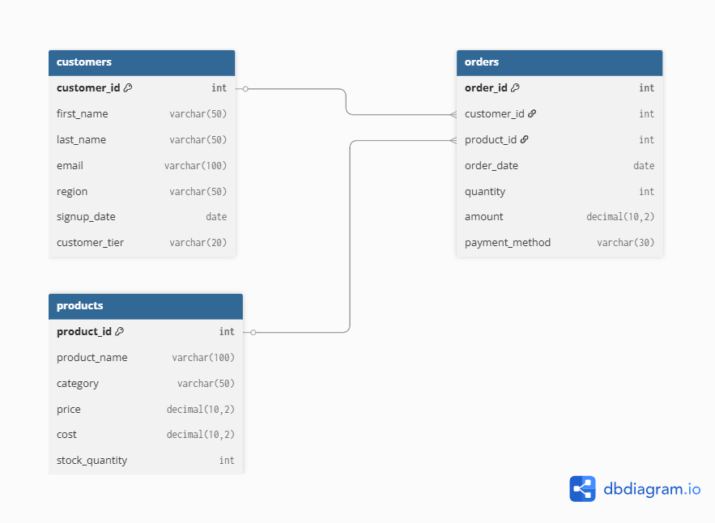

# SQL JOINs & Window Functions Project

**Course**: Database Development with PL/SQL (INSY 8311)  
**Instructor**: Eric Maniraguha  
**Student**: SHEMA Serge
**Student ID**: 27879 
**Group**: C 
**Submission Date**: 02/06/2026  
**Repository**: https://github.com/Sajghaa/plsql-learning-path/tree/main/03-school-projects/plsql_window_functions_27879_SHEMA_Serge

---

##  Business Scenario: E-Commerce Sales Analytics

### Business Context
ABC Retail is an online e-commerce company operating in the electronics and home appliances sector. The sales department needs to analyze customer purchasing patterns, product performance across regions, and identify growth opportunities for targeted marketing campaigns.

### Data Challenge
The company lacks consolidated insights into:
1. Regional product performance variations
2. Customer purchasing frequency and value segmentation
3. Monthly sales trends and growth patterns
4. Identification of products with no sales activity
5. Customer retention and churn indicators

### Expected Outcome
Actionable insights to:
- Optimize inventory distribution across regions
- Design personalized marketing campaigns
- Identify growth opportunities in underperforming regions
- Improve customer retention strategies

---

##  Database Schema Design

### Tables Overview
1. **customers** - Customer master data
2. **products** - Product catalog information  
3. **orders** - Sales transaction records

### Entity-Relationship Diagram


### Schema Creation Script
```sql
-- See sql_scripts/01_schema_creation.sql